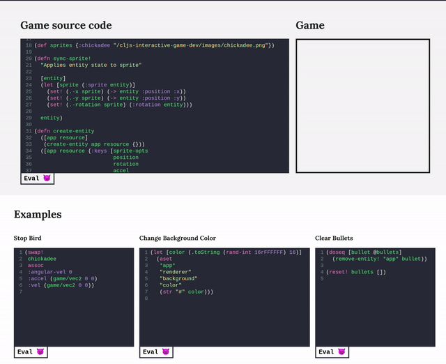

# Clojurescript interactive game maker [WIP!] #

Experiment with self hosting CLJS code in the browser for interactive docs e.t.c.



Accessible at: https://bananaoomarang.github.io/cljs-interactive-game-dev/

### Running Locally ###

```
$ npx shadow-cljs watch bootstrap frontend
```

App will be served on http://localhost:8080/
